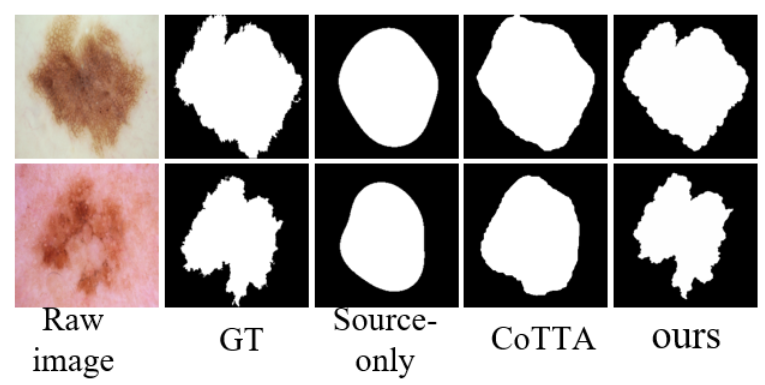
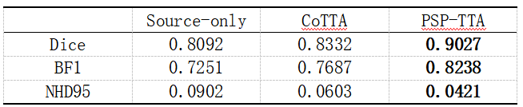
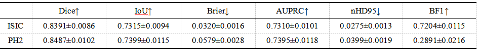
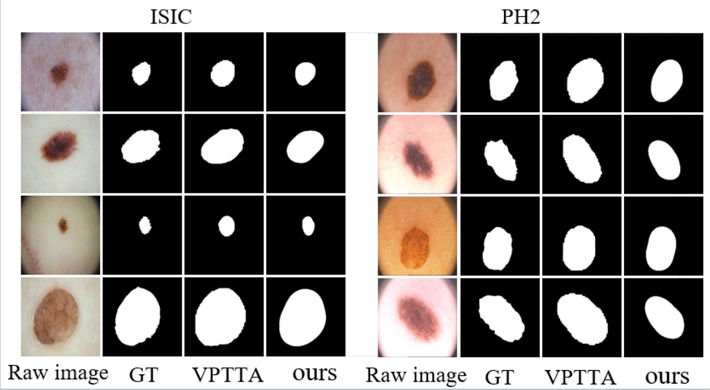
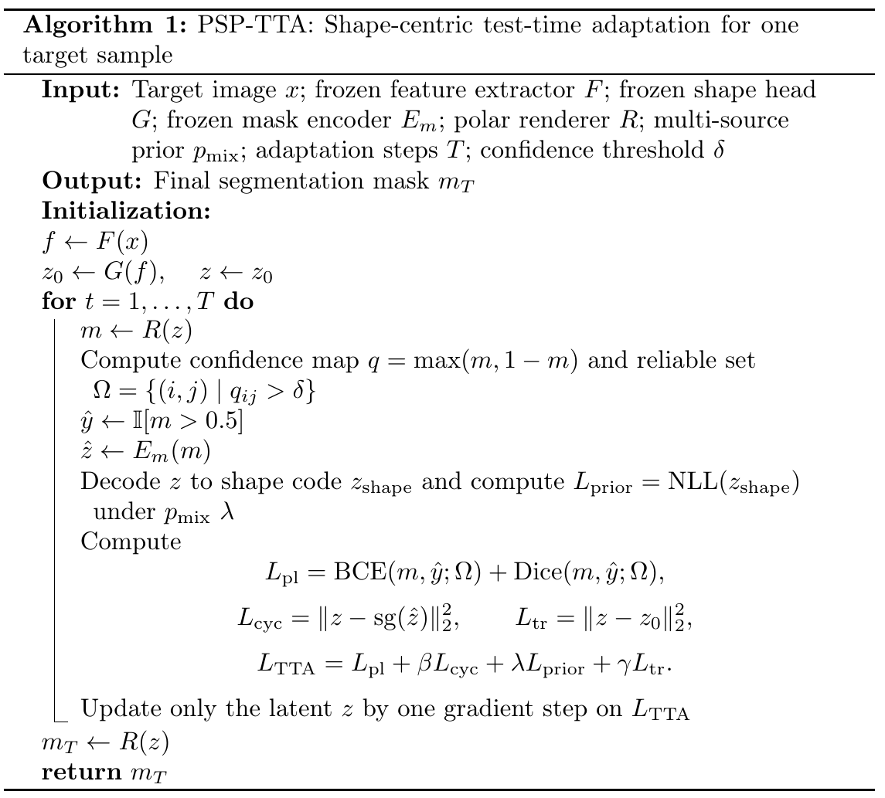
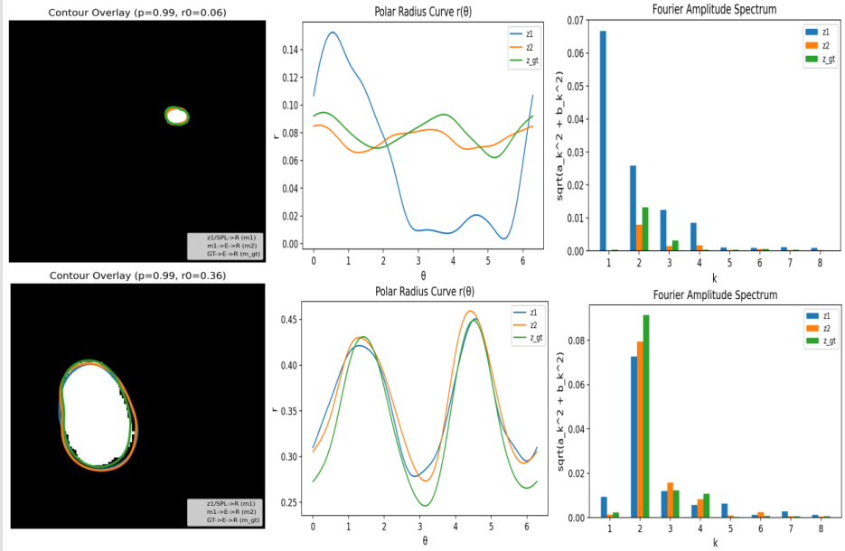
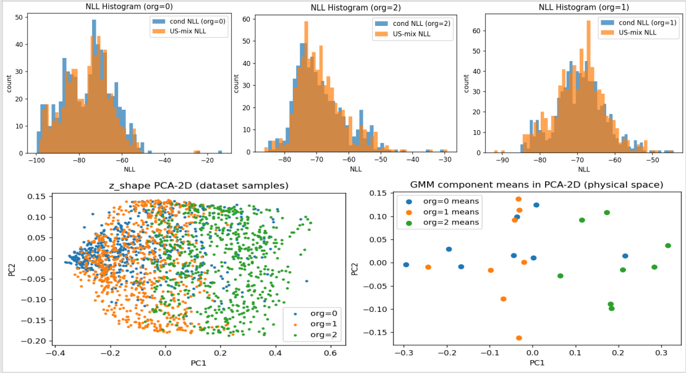

# Supplementary figures and tables

## 1. Results on the irregular subset

## 2. Three-seed results for stronger baselines 

## 3. Add the medical-specific baseline VPTTA

## 4. Pseudocode algorithm table

## 5. Figure 4 and Figure 5 presentation

